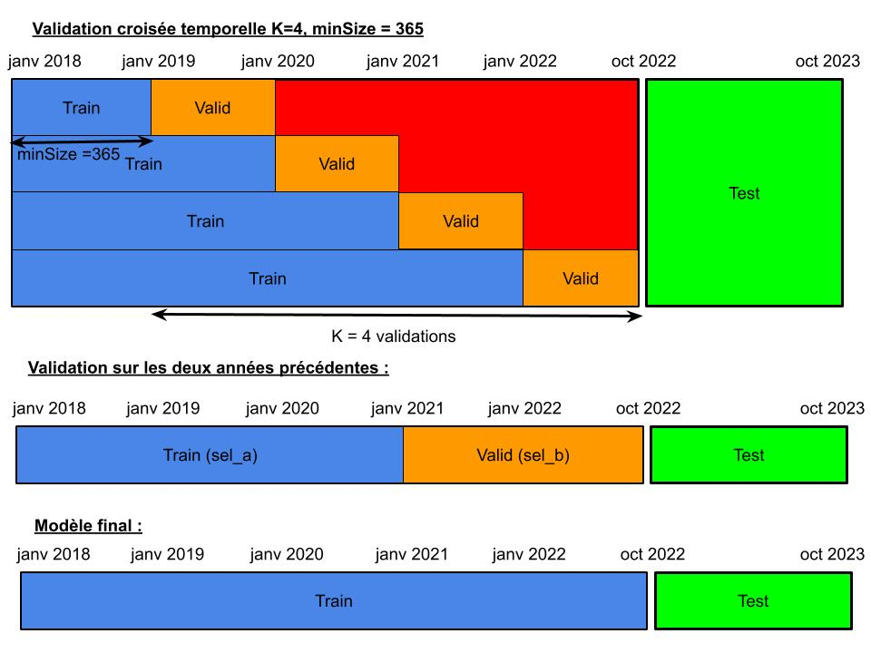

```{r setup, include=FALSE}
knitr::opts_chunk$set(fig.pos = "H", out.extra = "")
```

```{r, echo=FALSE, include=FALSE}
library(lubridate)
library(mgcv)
library(yarrr)
library(magrittr)
library(forecast)
library(tidyverse)
library(ranger)
library(gbm)
source("R/score.R")
```

# Rapport Modélisation prédictive

### Introduction

L'objectif de ce projet de modélisation est d'expliquer au mieux la
consommation énergétique en France durant la période de sobriété
énergétique (octobre 2022 - octobre 2023). L'enjeu est de limiter le
surplus de production dans un contexte économique et énergétique en
tension où l'on a incité à baisser drastiquement notre consommation.
Dans ce contexte, la variable cible de notre problème de modélisation
est le quantile 95% de la demande nette d'énergie qui retire à la
consommation brute les productions renouvelables estimées (solaire et
éolienne).

```{r, echo=FALSE, include=FALSE}
Data0 <- read_csv('Data/train2.csv')
Data1 <- read_csv('Data/test2.csv')
```

### Prise en main des données et premières visualisations

Pour la première semaine, nous nous sommes concentrés sur la
visualisation et la compréhension des données. Nous avons effectué une
première soumission de forêt aléatoire simple sur quelques variables
explicatives pour se donner un premier score et résultats de référence,
en prenant des variables de températures dont on peut visualiser la
forte anti-corrélation avec la demande nette :

```{r}
eq0 = Net_demand ~  Time + toy + Temp + Net_demand.1 + Net_demand.7 +Temp_s99 +
WeekDays + BH + Temp_s95_max + Temp_s99_max + Summer_break  + Christmas_break + 
  Temp_s95_min +Temp_s99_min + DLS 
```

```{r, echo=FALSE,fig.pos = "H", fig.width=8, fig.height=3}
plot(Data0$Date, Data0$Net_demand, type='l')
par(new=T)
plot(Data0$Date, Data0$Temp, type='l', col='red', axes=F,xlab='',ylab='')
axis(side = 4,col='red', col.axis='red')
mtext(side = 4, line = 3, 'Temperature', col='red')
legend("top",c("Net_demand","Temperature"),col=c("black","red"),lty=1,ncol=1,bty="n")
```

Nous avons également restreint notre jeu d'entrainement aux données
prises depuis 2018 pour deux raisons particulières : D'une part, pour
que nos modèles tiennent plus en compte la période récente et ne se
surajustent pas à des phénomènes passés dont on suppose qu'ils ont moins
d'influence sur les comportement de la consommation actuelle. D'autre
part, on visualise aussi que certaines variables (nebulosité) ont été
mesurées différement avant 2018 et risquent ainsi d'apporter du biais
sur nos modèles

```{r, echo=FALSE}
plot(Data0$Date, Data0$Nebulosity, type='l', col='black',xlab='Date',ylab='Nebulosity')
```

```{r, echo=FALSE, include=FALSE}
Data0 = read_csv('Data/train3.csv')
Data1 = read_csv('Data/test3.csv')
```

Par ailleurs, on a aussi ajouté de nouvelles variables dont on a pu
supposer et vérifier l'impact significatif sur nos modèles (que ce soit
pour l'explication de la variance ou pour la hausse de la précsion en
validation) :

-   La variable factorielle Covid, indiquant les périodes de confinement
    et dont on a pu constater l'effet au vu des variations de la
    consommation en 2020 par rapport aux autres années

-   Une variable factorielle WeekDays3, qui permet de mettre en avant
    les jours de travail en semaine, qui permettent notamment
    d'expliquer la différence de consommation par rapport aux week-ends.

-   La variable Temp_trunc, troncature sur les températures pour
    capturer les phenomènes extremes

-   Price et Inflation (INSEE) : données malheuresement peu exploitables
    car non quotidiennes et prises tous les six mois. L'idée de départ
    était de supposer que la consommation aurait pu être impactée par
    l'inflation et une hausse du prix de l'éléctricité

Pour valider nos modèles nous nous sommes basés conjointement sur deux
métriques : la RMSE et la pinball Loss.

La RMSE nous a permis d'évaluer la performance globale de nos modèles et
de vérifier que l'on ne se trouvait pas en situation de
sous-apprentissage ou sur-apprentissage.

La pinballLoss était étudiée en parallèle pour mieux percevoir en
particulier la capacité de notre modèle à prédire les quantiles de
manière précise et robuste (car il s'agit de notre objectif final)

Pour avoir une idée plus précise de la robustesse de nos modèles et de
leur capacité à généraliser, nous avons effectué pour chaque modèle :

-   Une validation croisée temporelle avec un nombre de validations
    généralement de 4 (pour séparer selon chaque année)
-   Une validation sur une période de 18 mois avant la période de test



**Remarque :** on constatera souvent de moins bonnes performances pour
le deuxième bloc de validation (si l'on prend K=4). Cela s'explique par
le fait que ce bloc de validation tombe en période de Covid dont l'effet
n'est pas encore visible sur les périodes précédentes.

### Modèles linéaires

Nous nous sommes d'abord intéressés au modèles de régression linéaire,
en effectuant une analyse ascendante : on a ajouté au fur et à mesure
les variables pour lesquelles on a pu observer à la fois une hausse de
la variance expliquée / significativité globale du modèle (critère du
R2, test de significativité de Student pour chacune des variables),
ainsi qu'une hausse de la qualité de prédiction en validation croisée (à
la fois sur le jeu d'entraînement et de validation).

Une première équation de référence prend en compte le temps et les
variables de décalage sur la demande nette (Net_demand.1, Net_demand.7),
la consommation globale (Load.1, Load.7), et la production solaire et
éolienne (Solar_power.1, Solar_power.7, Wind_power.1, Wind_power.7).
Elles permettent de mettre en avant la relation temporelle de nos
données :

```{r}
# Equation sur les variables de décalage temporel 
eq1 = Net_demand ~ as.numeric(Date) + Load.1 + Load.7 + Wind_power.1 + Wind_power.7 +
  Net_demand.1 + Net_demand.7 + Solar_power.1 + Solar_power.7
```

```{r, echo=FALSE}
timeCV("lm", eq1, Data0, Data0$Net_demand, 5, showPL=F)
```

On a avec ce modèle de base une variance expliquée à 87% en moyenne et
une RMSE élevée (supérieure à 3000) que ce soit pour le jeu
d'entraînement ou de validation, indiquant que l'on reste en
sous-apprentissage. De plus, la significativité est relativement faible
pour les variables décalées de sept jours, notamment pour la production
solaire et éolienne dont les phénomènes naturels n'ont pas de raison
d'être corrélés aux effets des semaines (contrairement à la Load et la
Net_demand qui sont liés aux activités humaines). On décide ainsi de
conserver les variables significatives et d'y ajouter les effets des
journées de travail, du covid ainsi que les effets météorologiques
(température, nébulosité, vent) pouvant expliquer la production solaire
et éolienne :

```{r}
# Effets des conditions météorologiques 
eq2 = Net_demand ~ as.numeric(Date) + Net_demand.1 + WeekDays3 + Covid + WeekDays3 +
  Nebulosity_weighted +  Wind_weighted + Temp
```

```{r, echo=FALSE}
timeCV("lm", eq2, Data0, Data0$Net_demand, 5, showPL=F)
```

On observe sur ce modèle de régression linéaire une forte hausse de la
significativité du modèle avec près de 95% de variance expliquée pour le
R2, et une diminution des erreurs de prévision (RMSE, MAPE) sur le jeu
d'entraînement et test de près de 30% du modèle précédent. La
significativité de ce modèle par rapport au précédent est également
justifiée par un test de rapport de vraisemblance (anova). Cependant, la
différence entre erreur d'entraînement et test est encore faible et la
RMSE élevée, ce qui laisse entendre que le modèle est encore en
sous-apprentissage.

En ajoutant et tesant plusieurs variables, nous avons finalement
convergé vers un premier modèle avec une significativité non négligeable
pour chacune des variables :

```{r}
# + effets des jours feriés 
eq3 = Net_demand ~ as.numeric(Date) + Load.1 + Wind_power.1 +
  Nebulosity_weighted +  Wind_weighted + Temp + Temp_s95 +
  Summer_break + Christmas_break + DLS + BH_Holiday + Holiday + 
  BH_before + Wind
```

```{r, echo=FALSE}
timeCV("lm", eq3, Data0, Data0$Net_demand, 5, showPL=F)
```

Ces modèles de regression font en particulier une hypothhèse gaussienne
sur la distribution des résidus, centrés en 0 et de variance constante.
En visualisant la distribution sur les résidus de nos modèles et en
tracant le QQplot des résidus, on se permet ici de valider cette
hypothèse :

```{r, echo=FALSE}
m3 = lm(eq3, data=Data0)
res3 = residuals(m3)
qqnorm(res3, main="Residuals - normal QQplot eq3")

qqline(res3)
```

```{r, echo=FALSE, fig.pos = "H", fig.width=8, fig.height=3}
par(mfrow=c(1, 1))
plot(res3~Data0$Date, xlab="Date", main="Saisonalité sur les résidus en fonction du temps")
```

On constate cependant encore un comportement saisonnier sur les résidus
en fonction du temps. De plus l'écart entre erreur d'entrainement et
validation est faible et l'erreur globale élevée. Cela laisse entendre
que l'on reste en sous apprentissage et que l'on peut encore tenter
d'expliquer la variabilité des résidus.

Nous avons également tenté l'ajout de variables par transformée de
fourier : le score pinball du modèle a également été amélioré par
l'ajout de 20 nouvelles variables (cos et sin) produites par une série
de Fourier. Nous avons également essayé la regression quantile mais qui
n'a pas apporté de résultat plus significatif.

Equation par série de fourier :

```{r}
# Equation avec série de fourier 
eqFourier = Net_demand ~ WeekDays3 + Temp + Temp_trunc1 + Temp_trunc2 + 
  Nebulosity_weighted + Wind_weighted + BH + Cos_i + Sin_i + Net_demand.1 + Net_demand.7
```

Un dernier essai a été de décomposer la prédiction de la demande nette
par l'estimation de la consommation brute et la production renouvelable
séparemment.

Cependant nous ne sommes pas parvenu à trouver des modèles permettant de
prédire très efficacement les productions solaires et éoliennes (moins
de variables explicatives pour ces phenomènes et R_2 ne dépassant pas
les 90% de variance expliquée).

En conséquence, la RMSE accumulée de ces modèles séparés donnait des
résultats moins bons que certains des premiers modèles réalisés sur la
demande nette. Nous avons donc abandonné cette idée.

### Modèles additifs

Afin d'améliorer encore la qualité de nos prévisions, nous nous sommes
ensuite intéréssés aux modèles additifs, qui nous ont permis de lisser
certaines relations non linéaires de nos covariables et de gagner
davantage en précision.

Avec le nombre important de combinaison et d'interactions de variables
possibles, nous avons convergé vers plusieurs modèles gam qui ont
apporté de meilleurs résultats en validation croisée.

Nous avons porposé un premier modèle gam par analyse ascendante, en
ajoutant toujours progressivement des variables significatives :

```{r}
# Première equation gam 
eqGam1 = Net_demand~s(as.numeric(Date),k=3, bs='cr') + s(toy,k=20, bs='cc') + 
  s(Temp,k=10, bs='cr') + te(Net_demand.1,Net_demand.7, k=10, bs='cr') + 
  s(Temp_s99,k=10, bs='cr') + WeekDays2 + BH +
  te(Nebulosity_weighted,Wind_weighted,k=10, bs='cr') + Covid
```

```{r, echo=FALSE}
timeCV("gam", eqGam1, Data0, Data0$Net_demand, 5, showPL=F)
```

Dans ces modèles, nous avons un varaible cyclique **toy**. Pour les
autres variables, nous avons ajusté nos découpages (paramètre k) selon
les relations que nous avons visualisé. Voici quelques exemples
d'ajustement visualisés sur la variable de température et toy :

```{r, echo=FALSE, fig.pos = "H", fig.width=5, fig.height=3}
eqGamTemp = Net_demand~s(Temp, k=10, bs='cr')
mod = gam(eqGamTemp, data=Data0)
pred = predict(mod, newdata=Data0)
plot(Data0$Net_demand~Data0$Temp, main="Net_demand~s(Temp, k=10)")
points(pred~Data0$Temp, col='red')
```

La variable cyclique toy en particulier nous permet de capturer des
tendances de variabilité différentes sur une année complète. En
augmentant le paramètre k à 20, on peut ainsi capturer plusieurs
comportements différents sur l'année. Nous avons vérifié en parallèle
que ce choix de paramètre n'amenait pas de surapprentissage en
validation croisée :

```{r, echo=FALSE, fig.pos = "H", fig.width=5, fig.height=3}
eqGamToy = Net_demand~s(toy, k=20, bs='cc')
mod = gam(eqGamToy, data=Data0)
pred = predict(mod, newdata=Data0)
plot(Data0$Net_demand~Data0$toy, main="Net_demand~s(toy, k=20)")
points(pred~Data0$toy, col='red')
```

Une deuxième version du gam avec BH_before en plus :

```{r}
# eqGam2 
eqGam2 = Net_demand~s(as.numeric(Date),k=3, bs='cr') + s(toy, k=20, bs='cc') +
  s(Temp,k=10, bs='cr') + te(Net_demand.1,Net_demand.7, k=10, bs='cr') +
  s(Temp_s99,k=10, bs='cr') + WeekDays2 + BH + 
  te(Nebulosity_weighted,Wind_weighted,k=10, bs='cr') + Covid + BH_before
```

```{r, echo=FALSE}
timeCV("gam", eqGam2, Data0, Data0$Net_demand, 5, showPL=F)
```

Cependant, la significativité par rapport au modèle précédent reste
faible ici.

Nous avons aussi cherché des modèles gam en repartant de l'équation eq3
de nos modèles linéaires, en lissant les covariables et en supposant que
le meilleur modèle pour la regression linéaire serait une meilleure
référence pour nos modèles additifs. Sur ce modèle en particulier, on a
jouté l'effet des vacances. En particulier **Holiday_zone_b** est un peu
plus significative ici, suggérant que la zone centrale des périodes de
vacances est plus pertinent (possiblement car elle est la période où le
plus de personnes sont en vacances)

```{r}
# Analyse ascendante en partant de eq3 
eqGam3 = Net_demand ~ s(as.numeric(Date), k=3, bs='cr') + te(Load.1, Load.7, bs='cr') +
  Solar_power.1 + Wind_power.1 + Net_demand.1 + Net_demand.7 + WeekDays3 + Covid +
  Nebulosity_weighted + Wind_weighted + te(Temp, Temp_s95, k=3, bs='cr') + 
  Summer_break + Christmas_break + DLS + BH_Holiday + s(toy, k=20, bs='cc') +
  + Holiday + Holiday_zone_b +  BH + BH_before + BH_after
```

```{r, echo=FALSE}
timeCV("gam", eqGam3, Data0, Data0$Net_demand, 5, showPL=F)
```

Sur ce modèle encore, on est parvenu à baisser de manière bien plus
significative nos scores de train et tests. En validation croisée, la
RMSE test et train est ici entre 1000 et 1200 environ sur les dernières
périodes. Il s'agit du modèle gam simple qui a donné la plus grande
performance sur kaggle sur le private set (129 sur le private set,
visible après coup seulement).

De la même manière que pour la régression linéaire, on a également
supposé une distribution gaussienne de nos résidus au vu du QQplot
ci-dessous :

```{r, echo=FALSE, fig.pos = "H", fig.width=5, fig.height=3}
modele = gam(eqGam3, data=Data0)
residuals = residuals(modele)
qqnorm(residuals, main="Final gam model : normal QQplot on residuals")
qqline(residuals)
```

A ce stade nous ne sommes pas vraiment parvenu à trouver

de modèles significativement meilleurs. Nous nous sommes donc ensuite
intéréssés aux résidus des modèles gam pour voir si l'on pouvait encore
tenter d'expliquer une part de variabilité.

### Random forest sur les résidus

Ce dernier modèle gam a été retenu comme référence à nouveau pour
effectuer des random forest gaussiennes sur les résidus. On a au départ
proposé deux nouveaux modèles :

En réappliquant ce qui fonctionnait avec le modèle précédent (notamment
des regroupements de variables sous un te()), Deux nouveaux modèles ont
été proposés avec une forêt aléatoire sur les résidus :

```{r}
# Modele A : 
eqGamRf1 = Net_demand~s(as.numeric(Date),k=3, bs='cr') + 
  te(Load.1, Load.7, bs='cr') + te(Net_demand.1, Net_demand.7, bs='cr') + 
  Solar_power.1 + Wind_power.1 + WeekDays3 + Covid+ Nebulosity_weighted + 
  Wind_weighted + te(Temp, Temp_s95, k=3, bs='cr') + Summer_break +
  DLS + BH_Holiday + BH_before + s(toy,k=30, bs='cc')

# + rf sur les résidus (complet)
```

```{r}
# Modele B : 
eqGamRf2 = Net_demand~s(as.numeric(Date),k=3, bs='cr') + te(Load.1, Load.7, bs='cr') +
  te(Net_demand.1, Net_demand.7, bs='cr') + te(Solar_power.1, Wind_power.1, bs='cr') +
  WeekDays3 + Covid + Nebulosity_weighted + Wind_weighted + 
  te(Temp, Temp_s95, k=3, bs='cr') + BH_Holiday + BH_before + s(toy,k=30, bs='cc') +
  Temp_trunc2 

# + rf sur les résidus (complet)
```

Même si les résultats en test ont été légèrement améliorés avec ces
modèles, on a constaté que l'écart en RMSE et MAPE se creuse davantage
entre la performance en entrainement et test sur la validation (\~ 500
en train, 1000 en test), ce qui laisse entendre que les méthodes de
random forest sur les résidus commencent à faire du surapprentissage.
Cependant, elles ont permis de baisser les scores de pinball loss.

### Recherche sur l'importance des variables pour les résidus/integration sur les modèles gam

Nous avons ensuite cherché à limiter le forêt aléatoire aux variables
les plus importantes : sur la figure ci-dessous, nous avons affiché
l'importance des variables sur les résidus provenant du gam **eqGamRf1**
:

```{r, echo=FALSE, fig.pos = "H", fig.width=8, fig.height=3}
residuals = residuals(gam(eqGamRf1, data=Data0))

eqRes = residuals ~ Net_demand.1 + Load.1 + Temp_s95_min + Temp_s95_max + Temp_s95 + Temp_s99_min + Temp_s99_max + Temp_s99 + Temp + Time + Wind_weighted + Nebulosity_weighted + Wind + Nebulosity + Holiday + Holiday_zone_a + Holiday_zone_b + Holiday_zone_c + BH_before + BH_after + BH + DLS + Net_demand.7 + Load.7 + Solar_power.1 + Solar_power.7 + Wind_power.1 + Wind_power.7 + Christmas_break + Summer_break + Covid + Price + Inflation
model_rf=ranger(eqRes,  data=cbind(Data0, residuals), importance='permutation')

varimp = sort(model_rf$variable.importance)
varimp = varimp[18:length(varimp)]
plot(1:length(varimp), varimp, main="Variable.importance on residuals", ylab="importance")
text(1:length(varimp), varimp, labels=names(varimp), pos = 1, cex = 0.5)
```

On voit ici que les valeurs expliquant au mieux les résidus sont les
variables Net_demand.1, Load.1 et les variables de températures. En se
restreignant aux variables les plus importantes, nous avons pu obtenir
un modèle gam avec random forest sur l'equation **eqGamRf1** nous
donnant finalement le modèle retenu avec un score public de 122 en
pinball loss et de 125 en score privé.

En se basant sur ces résultats nous avons ensuite cherché à trouver de
nouvelles relations entre les résidus restants et les variables les plus
significatives. On a visualisé ici la dépendance entre les résidus et
les variables les plus significatives pour la forêt aléatoire :

```{r, echo=FALSE, fig.width=8, fig.height=4}
par(mfrow=c(1, 1))
plot(residuals ~ Data0$Load.1, xlab='Load.1', ylab='residuals', main="Residuals depending on Load.1")
```

En rajoutant des interactions que l'on a trouvé significatives entre ces
variables (tests de significativité du summary), nous avons tenté
d'améliorer encore notre modèle gam (**eqGamRf1**). Nous avons en plus
essayé de raffiner les interactions entre variables en utilisant des
ti() (pour mieux distinguer les dépendances réellement significatives).

Mais les différences en résultats n'ont pas été significatifs en
validation et sur le score publique (que ce soit en RMSE \~1000 ou en
pinball loss \~130). Quelques uns des modèles essayés avaient été en
réalité plus performants sur le private set (avec le meilleur score
privé de 119 en pinball loss). Mais la différence n'est de quelques
points seulement, ce qui ne permet pas réellement de les considérer
comme meilleurs.

Une dernière idée aurait pu être de réaliser une aggrégation d'expert
pour pouvoir distinguer les meilleurs modèles et avoir une prévision
finale plus robuste.

### Boosting, dernières tentatives et conclusion

La dernière semaine a permis d'expérimenter le boosting. Nous avons
repris les équations **eqGamRf1** et **eqGamRf2**, mais en remplacant la
prédiction des résidus par des méthodes de Boosting. Nous avons
également essayé d'améliorer la pinball loss en passant sur des modèles
quantiles (qgam).

Aucune de ces méthodes n'a vraiment convaincu ou apporté de meilleurs
résultats par rapport à ce qui a été réalisé précédemment (scores
similaires ou même bien moins bons en validation croisée et sur kaggle).
Nous sommes donc resté sur les modèles que nous avions réalisés avec des
gam et random forest. Le modèle final retenu est **eqGamRf1.**
